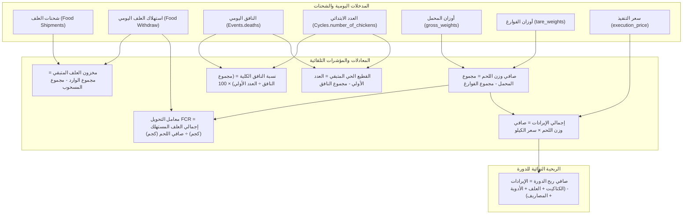

# 📊 الدليل البصري الشامل لقاعدة البيانات (Dawagen DB Visualization)

---

## 🗺️ 1. الخريطة الهيكلية للبيانات (System Data Flow Topology)

```
                              ┌───────────────────────────────────┐
                              │          CYCLES (الدورات)         │
                              │ --------------------------------- │
                              │ * id (PK)                         │
                              │ * started_at, ended_at            │
                              │ * chick_type, number_of_chickens  │
                              └─────────────────┬─────────────────┘
                                                │
       ┌────────────────────────┬───────────────┴───────────────┬────────────────────────┐
       ▼                        ▼                               ▼                        ▼
┌──────────────┐     ┌────────────────────┐          ┌──────────────────────┐   ┌─────────────────┐
│     DAYS     │     │   FOOD_SHIPMENTS   │          │  MEDICINE_INVOICES   │   │  EXPORT_SALES   │
│   (الأيام)   │     │   (شحنات العلف)    │          │    (فواتير الدواء)   │   │ (مبيعات التصدير)│
└──────┬───────┘     └─────────┬──────────┘          └──────────┬───────────┘   └────────┬────────┘
       │                       ▲                                ▲                        │
       ├──────────────┐        │ (is supplied by)               │ (is supplied by)       ▼
       │ (1:1)        │ (1:N)  │                                │                 ┌───────────────┐
       ▼              ▼        │                                │                 │   IMPORTERS   │
┌──────────────┐ ┌─────────┐   │                                │                 │  (المستوردين) │
│FOLLOW_UP_DATA│ │ EVENTS  │   │                                │                 └───────────────┘
│ (متابعة وزن) │ │ (الأحداث)│   │                                │
└──────────────┘ └────┬────┘   │                                │
                      │        │                                │
       ┌──────────────┼────────┴─────────┐                      │
       ▼              ▼                  ▼                      │
┌──────────────┐ ┌──────────────┐ ┌──────────────┐      ┌───────────────┐
│FOOD_WITHDRAW │ │DRUG_WITHDRAW │ │DAILY_EXPENSES│      │   MEDICINES   │
│ (سحب علف)    │ │ (سحب أدوية)  │ │(المصاريف)    │      │ (أصناف الدواء)│
└──────────────┘ └──────┬───────┘ └──────────────┘      └───────┬───────┘
                        │ (withdraws from)                      │
                        └───────────────────────────────────────┘
```

---



```mermaid
erDiagram
    %% ==========================================
    %% 1. CORE CYCLES & CALENDAR MODULE
    %% ==========================================
    CYCLES ||--o{ DAYS : "يحتوي على أيام الدورة"
    CYCLES ||--o{ FOOD_SHIPMENTS : "شحنات علف الدورة"
    CYCLES ||--o{ MEDICINE_INVOICES : "فواتير أدوية الدورة"
    CYCLES ||--o{ EXPORT_SALES : "مبيعات يوم الحصاد والتصدير"

    DAYS ||--o| FOLLOW_UP_DATA : "قياس أوزان العينات (1:1)"
    DAYS ||--o{ META_DATA : "بيانات وصفية متغيرة"
    DAYS ||--o{ EVENTS : "تسجيل أحداث اليوم"

    %% ==========================================
    %% 2. DAILY OPERATIONS & CONSUMPTION MODULE
    %% ==========================================
    EVENTS ||--o{ FOOD_WITHDRAW : "سحب علف يومي"
    EVENTS ||--o{ DRUG_WITHDRAW : "سحب أدوية وتحصين"
    EVENTS ||--o{ DAILY_EXPENSES : "مصاريف تشغيلية"

    %% ==========================================
    %% 3. FEED & SUPPLIERS MODULE
    %% ==========================================
    FEED_SUPPLIERS ||--o{ FOOD_SHIPMENTS : "يورد شحنات العلف"
    FOOD_SHIPMENTS ||--o{ FOOD_WITHDRAW : "يُستهلك منه"

    %% ==========================================
    %% 4. MEDICINE & VETERINARY MODULE
    %% ==========================================
    MEDICINE_SUPPLIERS ||--o{ MEDICINE_INVOICES : "يصدر فواتير"
    MEDICINE_INVOICES ||--o{ MEDICINES : "تحتوي على أصناف"
    MEDICINES ||--o{ DRUG_WITHDRAW : "يُسحب منها للطيور"

    %% ==========================================
    %% 5. HARVEST & SALES MODULE
    %% ==========================================
    IMPORTERS ||--o{ EXPORT_SALES : "يشتري شحنات التصدير"

    %% ==========================================
    %% ENTITY DEFINITIONS & ATTRIBUTES
    %% ==========================================
    CYCLES {
        int id PK "🔑 معرف الدورة الفريد"
        timestamp started_at "📅 تاريخ بداية الدورة"
        timestamp ended_at "🏁 تاريخ الإغلاق"
        boolean is_active "⚡ جارية حالياً؟"
        string chick_type "🐣 سلالة الكتاكيت (كب، روص...)"
        int number_of_chickens "🔢 العدد المستلم"
        decimal chick_price "💰 سعر الكتكوت الواحد"
    }

    DAYS {
        int id PK "🔑 معرف اليوم"
        int parent_cycle_id FK "🔗 معرف الدورة"
        int day_number "📆 رقم اليوم (1, 2, ...)"
        date date "🗓️ التاريخ الفعلي"
        text notes "📝 ملاحظات عامة"
    }

    FOLLOW_UP_DATA {
        int id PK "🔑 معرف السجل"
        int parent_day_id FK "🔗 معرف اليوم (1:1 Unique)"
        decimal weight_small "🐥 وزن العينة الصغيرة (جم)"
        decimal weight_medium "🐔 وزن العينة المتوسطة (جم)"
        decimal weight_large "🐓 وزن العينة الكبيرة (جم)"
        decimal weight_random_sample "⚖️ وزن عينة عشوائية (جم)"
    }

    META_DATA {
        int id PK "🔑 معرف السجل"
        int parent_day_id FK "🔗 معرف اليوم"
        string meta_name "🏷️ اسم الخاصية (رطوبة، تهوية...)"
        text meta_value "📄 قيمة الخاصية"
    }

    EVENTS {
        int id PK "🔑 معرف الحدث"
        int parent_day_id FK "🔗 معرف اليوم"
        int deaths "☠️ عدد النافق اليومي"
        decimal temperature_inside "🌡️ حرارة العنبر (°C)"
        string event_executer "👷 القائم بالتسجيل/العامل"
    }

    FOOD_WITHDRAW {
        int id PK "🔑 المعرف"
        int event_id FK "🔗 معرف الحدث"
        int food_id FK "🔗 شحنة العلف المسحوبة"
        decimal sacks_consumed "🥣 عدد الشكاير المستهلكة"
        string consumption_type "🏷️ Feeding | Damaged | Other"
    }

    DRUG_WITHDRAW {
        int id PK "🔑 المعرف"
        int event_id FK "🔗 معرف الحدث"
        int drug_id FK "🔗 معرف الدواء من المخزن"
        int packages_count "📦 عدد العبوات"
        string consumed_capacity "🧪 السعة المستهلكة (مثال: 250 مل)"
    }

    DAILY_EXPENSES {
        int id PK "🔑 المعرف"
        int event_id FK "🔗 معرف الحدث"
        string expense_item "💸 بند المصروف (نشارة، غاز...)"
        decimal amount "💵 المبلغ المدفوع"
        string payment_type "💳 Cash | Transfer"
    }

    FEED_SUPPLIERS {
        int id PK "🔑 معرف المورد"
        string name "🏭 اسم الشركة أو التاجر"
        string phone_number "📞 رقم الهاتف"
        string vehicle_types "🚚 سيارات النقل"
        string place "📍 العنوان / المحافظة"
        jsonb cycles "📦 الدورات المشتركة [14, 15]"
    }

    FOOD_SHIPMENTS {
        int id PK "🔑 معرف الشحنة"
        int supplier_id FK "🔗 مورد العلف"
        int cycle_id FK "🔗 الدورة التابعة لها"
        string feed_name "🌾 اسم ونوع العلف (بادي 23%)"
        int sacks_count "📦 عدد الشكاير في الحمولة"
        decimal sack_weight "⚖️ وزن الشكارة (50 كجم)"
        decimal sack_price "💵 سعر الشكارة"
        decimal total_cost "🧮 إجمالي الحمولة (تلقائي)"
        jsonb payments "💳 سجل الدفعات المؤرخة"
    }

    MEDICINE_SUPPLIERS {
        int id PK "🔑 معرف المورد"
        string name "🏥 الصيدلية البيطرية"
        string phone_number "📞 رقم الهاتف"
        string place "📍 المكان"
        jsonb cycles "📦 الدورات"
        jsonb payments_without_invoices "💳 دفعات مباشرة بدون فواتير"
    }

    MEDICINE_INVOICES {
        int id PK "🔑 معرف الفاتورة"
        int supplier_id FK "🔗 مورد الدواء"
        int cycle_id FK "🔗 الدورة المشتراة لأجلها"
        string invoice_number "🧾 رقم الفاتورة الورقية"
        date invoice_date "📅 تاريخ الفاتورة"
        jsonb payments "💳 دفعات السداد المؤرخة"
    }

    MEDICINES {
        int id PK "🔑 معرف الصنف"
        int invoice_id FK "🔗 الفاتورة التابع لها"
        int supplier_id FK "🔗 مورد الدواء"
        int cycle_id FK "🔗 الدورة"
        string name "💊 اسم الدواء التجاري"
        string unit_capacity "🧪 سعة العبوة (1 لتر / 500 جم)"
        int units_count "📦 عدد العبوات"
        decimal unit_price "💵 سعر العبوة الواحدة"
        decimal total_price "🧮 الإجمالي (الوحدات × السعر)"
        text image_url "📷 صورة العلبة للتعرف البصري"
    }

    IMPORTERS {
        int id PK "🔑 معرف المستورد"
        string name "👤 اسم التاجر / المشتري"
        string phone_number "📞 رقم الهاتف"
        jsonb vehicle_types "🚚 أنواع وأرقام السيارات"
        string place "📍 السوق / المحافظة"
    }

    EXPORT_SALES {
        int id PK "🔑 معرف عملية البيع"
        int parent_cycle_id FK "🔗 الدورة"
        int importer_id FK "🔗 المشتري / التاجر"
        string vehicle_type "🚚 سيارة التحميل"
        int crates_count "📦 عدد الأقفاص (الطرود)"
        int crate_capacity "🐔 سعة القفص (عدد الطيور)"
        jsonb tare_weights "⚖️ أوزان الفوارغ لكل حطة ميزان"
        jsonb gross_weights "⚖️ أوزان المحمل لكل حطة ميزان"
        decimal execution_price "💵 سعر التنفيذ للكيلو الصافي"
        jsonb payments "💳 الدفعات المستلمة (كاش / محفظة)"
    }
```

## 🗂️ 2. مخطط الكيانات والعلاقات التفصيلي (Detailed Mermaid ERD)

---

## 🏗️ 3. عرض الجداول والوحدات بصرياً (Module-by-Module Visual Cards)

### 🔵 وحدة إدارة الدورات والأيام (Cycles & Daily Tracking)

```
┌─────────────────────────────────────────────────────────────────────────────────┐
│ 🔄 CYCLES (الدورات)                                                            │
├───────────────────┬──────────────┬──────────────┬───────────────────────────────┤
│ Column            │ Type         │ Key          │ Description                   │
├───────────────────┼──────────────┼──────────────┼───────────────────────────────┤
│ id                │ SERIAL       │ [PK]         │ المعرف الفريد للدورة          │
│ started_at        │ TIMESTAMP    │ NOT NULL     │ تاريخ بدء الدورة واستلام الصوص │
│ ended_at          │ TIMESTAMP    │ NULL         │ تاريخ إغلاق الدورة            │
│ is_active         │ BOOLEAN      │ DEFAULT TRUE │ الدورة النشطة الحالية         │
│ chick_type        │ VARCHAR(100) │ NOT NULL     │ سلالة الكتاكيت (كب، روص...)    │
│ number_of_chickens│ INT          │ NOT NULL     │ العدد الابتدائي للكتاكيت       │
│ chick_price       │ NUMERIC(10,2)│ DEFAULT 0    │ سعر شراء الكتكوت الواحد       │
└───────────────────┴──────────────┴──────────────┴───────────────────────────────┘
         │ (1:N)
         ▼
┌─────────────────────────────────────────────────────────────────────────────────┐
│ 📅 DAYS (الأيام)                                                                │
├───────────────────┬──────────────┬──────────────┬───────────────────────────────┤
│ id                │ SERIAL       │ [PK]         │ المعرف الفريد لليوم           │
│ parent_cycle_id   │ INT          │ [FK] cycles  │ الدورة التابع لها             │
│ day_number        │ INT          │ NOT NULL     │ رقم اليوم (1, 2, 3...)        │
│ date              │ DATE         │ NOT NULL     │ التاريخ الفعلي                │
│ notes             │ TEXT         │ NULL         │ ملاحظات عامة                  │
└───────────────────┴──────────────┴──────────────┴───────────────────────────────┘
         │
         ├───► ⚖️ FOLLOW_UP_DATA (1:1) [weight_small, weight_medium, weight_large, weight_random]
         ├───► 🏷️ META_DATA (1:N)       [meta_name, meta_value]
         └───► ⚡ EVENTS (1:N)          [deaths, temperature_inside, event_executer]
```

---

### 🟡 منظومة العلف والمخزون (Feed Supply & Inventory)

```
┌───────────────────────────────┐                  ┌──────────────────────────────────────────────┐
│ 🏭 FEED_SUPPLIERS             │                  │ 🌾 FOOD_SHIPMENTS (شحنات العلف)              │
├─────────────────┬─────────────┤                  ├──────────────────┬─────────────┬─────────────┤
│ id              │ [PK] SERIAL │                  │ id               │ [PK] SERIAL │ المعرف      │
│ name            │ VARCHAR     │                  │ supplier_id      │ [FK]        │ مورد العلف  │
│ phone_number    │ VARCHAR     │ ────────(1:N)───►│ cycle_id         │ [FK]        │ دورة الاستهلاك│
│ vehicle_types   │ VARCHAR     │                  │ feed_name        │ VARCHAR     │ نوع العلف   │
│ place           │ VARCHAR     │                  │ sacks_count      │ INT         │ عدد الشكاير │
│ cycles          │ JSONB       │                  │ sack_price       │ NUMERIC     │ سعر الشكارة │
└─────────────────┴─────────────┘                  │ total_cost       │ [GENERATED] │ عدد × سعر   │
                                                   │ payments         │ [JSONB]     │ سجل الدفعات │
                                                   └──────────────────┴─────────────┴─────────────┘
                                                                            │ (1:N)
                                                                            ▼
                                                   ┌──────────────────────────────────────────────┐
                                                   │ 🥣 FOOD_WITHDRAW (السحب اليومي للعلف)        │
                                                   ├──────────────────┬─────────────┬─────────────┤
                                                   │ id               │ [PK] SERIAL │ المعرف      │
                                                   │ event_id         │ [FK] events │ الحدث اليومي│
                                                   │ food_id          │ [FK] food   │ شحنة العلف  │
                                                   │ sacks_consumed   │ NUMERIC     │ الكمية المسحوبة│
                                                   │ consumption_type │ VARCHAR     │ Feeding/Damage│
                                                   └──────────────────┴─────────────┴─────────────┘
```

---

### 🟣 منظومة الأدوية والبيطرة (Veterinary & Medicines)

```
┌───────────────────────────┐         ┌────────────────────────────────┐         ┌────────────────────────────────┐
│ 🏥 MEDICINE_SUPPLIERS     │         │ 🧾 MEDICINE_INVOICES           │         │ 💊 MEDICINES (أصناف الدواء)    │
├─────────────┬─────────────┤         ├──────────────────┬─────────────┤         ├──────────────────┬─────────────┤
│ id          │ [PK] SERIAL │         │ id               │ [PK] SERIAL │         │ id               │ [PK] SERIAL │
│ name        │ VARCHAR     │──(1:N)─►│ supplier_id      │ [FK]        │──(1:N)─►│ invoice_id       │ [FK]        │
│ phone_number│ VARCHAR     │         │ cycle_id         │ [FK] cycles │         │ name             │ VARCHAR     │
│ place       │ VARCHAR     │         │ invoice_number   │ VARCHAR     │         │ unit_capacity    │ VARCHAR     │
│ payments_w_o│ [JSONB]     │         │ invoice_date     │ DATE        │         │ units_count      │ INT         │
└─────────────┴─────────────┘         │ payments         │ [JSONB]     │         │ unit_price       │ NUMERIC     │
                                      └──────────────────┴─────────────┘         │ total_price      │ [GENERATED] │
                                                                                 │ image_url        │ TEXT        │
                                                                                 └──────────────────┴─────────────┘
                                                                                                │ (1:N)
                                                                                                ▼
                                                                                 ┌────────────────────────────────┐
                                                                                 │ 💉 DRUG_WITHDRAW (سحب الدواء)  │
                                                                                 ├──────────────────┬─────────────┤
                                                                                 │ id               │ [PK] SERIAL │
                                                                                 │ event_id         │ [FK] events │
                                                                                 │ drug_id          │ [FK] meds   │
                                                                                 │ packages_count   │ INT         │
                                                                                 │ consumed_capacity│ VARCHAR     │
                                                                                 └──────────────────┴─────────────┘
```

---

### 🟢 مبيعات يوم التصدير والحصاد (Harvest & Export Sales)

```
┌───────────────────────────┐                  ┌────────────────────────────────────────────────────────┐
│ 👤 IMPORTERS (التجار)     │                  │ 🚛 EXPORT_SALES (شحنات التصدير والبيع)                 │
├─────────────┬─────────────┤                  ├───────────────────┬─────────────┬──────────────────────┤
│ id          │ [PK] SERIAL │                  │ id                │ [PK] SERIAL │ معرف العملية         │
│ name        │ VARCHAR     │                  │ parent_cycle_id   │ [FK] cycles │ الدورة المباع منها   │
│ phone_number│ VARCHAR     │ ────────(1:N)───►│ importer_id       │ [FK] import │ التاجر المشتري       │
│ vehicle_type│ [JSONB]     │                  │ vehicle_type      │ VARCHAR     │ سيارة الشحن          │
│ place       │ VARCHAR     │                  │ crates_count      │ INT         │ عدد الأقفاص          │
└─────────────┴─────────────┘                  │ crate_capacity    │ INT         │ سعة القفص (عدد طيور) │
                                               │ tare_weights      │ [JSONB]     │ [250, 248.5, 252...] │
                                               │ gross_weights     │ [JSONB]     │ [1420, 1380, 1450..] │
                                               │ execution_price   │ NUMERIC     │ سعر الكيلو الصافي    │
                                               │ payments          │ [JSONB]     │ [{amount, way:Cash}] │
                                               └───────────────────┴─────────────┴──────────────────────┘
```

---

## 🧮 4. شجرة تدفق الحسابات والمؤشرات الحيوية (Data Lineage & Formula Tree)



---

## 📋 5. جدول مصفوفة المفاتيح والعلاقات (Relationship Matrix)

| الجدول الأب (Parent) | الجدول التابع (Child) | نوع العلاقة | المفتاح الأجنبي (Foreign Key)   | سلوك الحذف (On Delete)                    |
| :------------------- | :-------------------- | :---------: | :------------------------------ | :---------------------------------------- |
| `cycles`             | `days`                |   `1 : N`   | `days.parent_cycle_id`          | `CASCADE` (حذف اليوميات تلقائياً)         |
| `cycles`             | `food_shipments`      |   `1 : N`   | `food_shipments.cycle_id`       | `CASCADE`                                 |
| `cycles`             | `medicine_invoices`   |   `1 : N`   | `medicine_invoices.cycle_id`    | `CASCADE`                                 |
| `cycles`             | `export_sales`        |   `1 : N`   | `export_sales.parent_cycle_id`  | `CASCADE`                                 |
| `days`               | `follow_up_data`      |   `1 : 1`   | `follow_up_data.parent_day_id`  | `CASCADE`                                 |
| `days`               | `meta_data`           |   `1 : N`   | `meta_data.parent_day_id`       | `CASCADE`                                 |
| `days`               | `events`              |   `1 : N`   | `events.parent_day_id`          | `CASCADE`                                 |
| `events`             | `food_withdraw`       |   `1 : N`   | `food_withdraw.event_id`        | `CASCADE`                                 |
| `events`             | `drug_withdraw`       |   `1 : N`   | `drug_withdraw.event_id`        | `CASCADE`                                 |
| `events`             | `daily_expenses`      |   `1 : N`   | `daily_expenses.event_id`       | `CASCADE`                                 |
| `feed_suppliers`     | `food_shipments`      |   `1 : N`   | `food_shipments.supplier_id`    | `RESTRICT` (منع حذف المورد مع وجود شحنات) |
| `food_shipments`     | `food_withdraw`       |   `1 : N`   | `food_withdraw.food_id`         | `RESTRICT`                                |
| `medicine_suppliers` | `medicine_invoices`   |   `1 : N`   | `medicine_invoices.supplier_id` | `RESTRICT`                                |
| `medicine_invoices`  | `medicines`           |   `1 : N`   | `medicines.invoice_id`          | `CASCADE`                                 |
| `medicines`          | `drug_withdraw`       |   `1 : N`   | `drug_withdraw.drug_id`         | `RESTRICT`                                |
| `importers`          | `export_sales`        |   `1 : N`   | `export_sales.importer_id`      | `RESTRICT`                                |

---

> 📌 **تم إعداد هذا التوثيق البصري ليكون مرجعاً تصميمياً شاملاً في ملفات الـ Markdown بالمشروع.**
